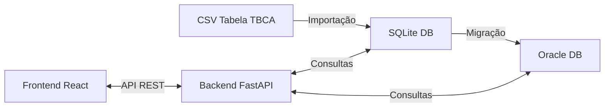

# Nutri-App: Sistema de Gestão de Dados Nutricionais


Aplicação web completa para consulta de informações nutricionais baseada na Tabela Brasileira de Composição de Alimentos (TBCA), com recursos avançados de pesquisa, cálculos nutricionais e visualização de dados.

## 📌 Visão Geral

O Nutri-App é uma solução completa que oferece:

- Consulta detalhada de alimentos e seus nutrientes
- Cálculos nutricionais por porção
- Pesquisa avançada por tipo de alimento
- Integração com banco Oracle para alta performance
- Interface web responsiva para acesso em diversos dispositivos

> **Importante**: Este repositório contém apenas o código do projeto e dados de amostra. O arquivo completo da base de dados (~50MB, 230.000+ registros) está disponível para download separadamente (ver seção [Dados Completos](#dados-completos)).

## 🔍 Screenshots

<table>
  <tr>
    <td></td>
    <td></td>
  </tr>
  <tr>
    <td></td>
    <td></td>
  </tr>
</table>

## 📂 Estrutura do Projeto

```
nutri-app/
│
├── backend/                  # API e serviços de dados
│   ├── app/                  # Aplicação principal
│   │   ├── models/           # Modelos de dados
│   │   ├── routes/           # Endpoints da API
│   │   └── services/         # Serviços de negócio
│   ├── data/                 # Scripts de importação
│   └── tbca.db               # Banco SQLite (dados de amostra)
│
├── frontend/                 # Interface de usuário
│   ├── public/               # Arquivos estáticos
│   └── src/                  # Código fonte React/JS
│       ├── components/       # Componentes reutilizáveis
│       ├── pages/            # Páginas da aplicação
│       └── services/         # Comunicação com API
│
├── scripts/                  # Scripts de automação
│   ├── migrate_sqlite_to_oracle.py  # Migração para Oracle
│   └── oracle_config_utils.py       # Utilitários Oracle
│
├── dados/                    # Arquivos de dados
│   └── teste_tbca.csv        # Dados de teste
│
├── docs/                     # Documentação
│   ├── images/               # Screenshots e diagramas
│   └── specifications/       # Especificações técnicas
│
├── importar_tbca_completo.py # Script principal de importação
├── menu_tbca_completo.py     # Menu interativo
├── check_database.py         # Verificação básica
└── check_database_avancado.py  # Verificação detalhada
```

## ⚙️ Arquitetura e Fluxo de Dados

### Diagrama de Arquitetura



### Componentes Principais

1. **Importador de dados (Python)**
   - Processamento do CSV (~230.000 linhas)
   - Normalização e categorização de dados

2. **API RESTful (Python/FastAPI)**
   - Endpoints para consulta de alimentos e nutrientes
   - Filtros avançados e paginação

3. **Frontend (React/JavaScript)**
   - Interface responsiva para consulta de dados
   - Visualizações e gráficos nutricionais

4. **Migração Oracle (Python/cx_Oracle)**
   - Scripts para migração de SQLite para Oracle
   - Otimizações de performance

## 🚀 Como Iniciar

### Pré-requisitos

- Python 3.8+
- Node.js 14+
- npm 6+
- Git

### Instalação

1. Clone o repositório
   ```bash
   git clone https://github.com/seu-usuario/nutri-app.git
   cd nutri-app
   ```

2. Configure o ambiente Python
   ```bash
   # Criar ambiente virtual
   python -m venv venv
   
   # Ativar ambiente (Windows)
   venv\Scripts\activate
   # OU (Linux/Mac)
   source venv/bin/activate
   
   # Instalar dependências
   pip install -r backend/requirements.txt
   ```

3. Configure o frontend
   ```bash
   cd frontend
   npm install
   ```

4. Verifique a instalação
   ```bash
   python verificacao_inicial_dev.py
   ```

### Execução com Dados de Amostra

1. Verifique o banco de dados de amostra
   ```bash
   python check_database.py
   ```

2. Inicie o backend
   ```bash
   cd backend
   python -m app.main
   ```
   API estará disponível em http://localhost:8000

3. Inicie o frontend (em outro terminal)
   ```bash
   cd frontend
   npm start
   ```
   Frontend estará disponível em http://localhost:3000

## 📊 Dados Completos

O arquivo completo da TBCA não está incluído neste repositório devido ao seu tamanho. Para usar o sistema com dados completos:

1. [Baixe o arquivo composicao_todos_alimentos.csv](https://link-para-download.com) (requer acesso)
2. Coloque o arquivo na raiz do projeto
3. Execute o importador:
   ```bash
   python menu_tbca_completo.py
   ```
4. Selecione a opção 1 para importar dados completos

> O processo de importação leva aproximadamente 5-10 minutos dependendo do hardware.

## 📋 Funcionalidades Detalhadas

### Backend

- **Modelo de Dados**
  - Tabelas: alimentos, nutrientes, grupos, alimentos_composicao
  - Relacionamentos otimizados para consulta eficiente

- **API Endpoints**
  ```
  GET /alimentos              # Lista de alimentos com filtros
  GET /alimentos/{id}         # Detalhes de um alimento
  GET /grupos                 # Lista de categorias/grupos
  GET /nutrientes/{alimento_id} # Nutrientes de um alimento
  ```

- **Features**
  - Paginação de resultados
  - Filtros por nome, grupo, valores nutricionais
  - Ordenação personalizada
  - Cache para melhor performance

### Frontend

- **Páginas**
  - Home: Visão geral e pesquisa rápida
  - Pesquisa avançada: Filtros completos
  - Detalhe do alimento: Informações nutricionais
  - Calculadora: Cálculos nutricionais por porção

- **Recursos**
  - Layout responsivo
  - Gráficos nutricionais
  - Exportação de dados
  - Favoritos/histórico de consultas

## ⚠️ Solução de Problemas

| Problema | Solução |
|----------|---------|
| **Erro de Importação**: "Arquivo CSV não encontrado" | Verifique se o arquivo está na raiz do projeto com nome exato |
| **Erro de Memória**: "MemoryError" durante importação | Feche outros aplicativos e tente novamente ou execute com `--low-memory` |
| **Erro de Codificação**: Caracteres especiais incorretos | Certifique-se que o CSV está em UTF-8 |
| **Erro de Conexão Oracle**: Falha na migração | Verifique configurações em `config/oracle_config.json` |
| **Erro no Frontend**: "Module not found" | Execute `npm install` na pasta frontend |

## 📈 Desempenho e Requisitos

### Hardware Recomendado
- CPU: 2+ cores
- RAM: 8GB (mínimo 4GB)
- Espaço em disco: 100MB

### Métricas de Performance
- Importação inicial: 5-10 minutos
- Migração para Oracle: 10-15 minutos
- Tempo de resposta API: <200ms

### Capacidade
- ~4.000 alimentos
- ~230.000 registros de composição
- ~30 tipos de nutrientes por alimento

## 🤝 Contribuindo

Contribuições são bem-vindas! Por favor, leia as [diretrizes de contribuição](CONTRIBUTING.md) antes de enviar pull requests.

## 📜 Licença

Este projeto está licenciado sob a Licença MIT - veja o arquivo [LICENSE.md](LICENSE.md) para detalhes.

## 📞 Contato

- **Email**: [ecardbrasil@gmail.com]
- **Issue Tracker**: [GitHub Issues](https://github.com/seu-usuario/nutri-app/issues)

---

## 🔄 CI/CD

Este projeto utiliza GitHub Actions para Integração Contínua e Entrega Contínua:

- **Integração Contínua**: Testes automatizados são executados em cada push e pull request
- **Verificação de Código**: Linting e testes de cobertura garantem qualidade de código
- **Build Automático**: Builds são gerados automaticamente para branches principais
- **Dependabot**: Atualizações automáticas de dependências para manter o projeto seguro

Os workflows estão configurados em `.github/workflows/`:
- `ci.yml`: Executa testes e builds
- `deploy.yml`: Realiza o deploy automático (apenas no branch main)

---

Desenvolvido por Vinicius Cardoso
